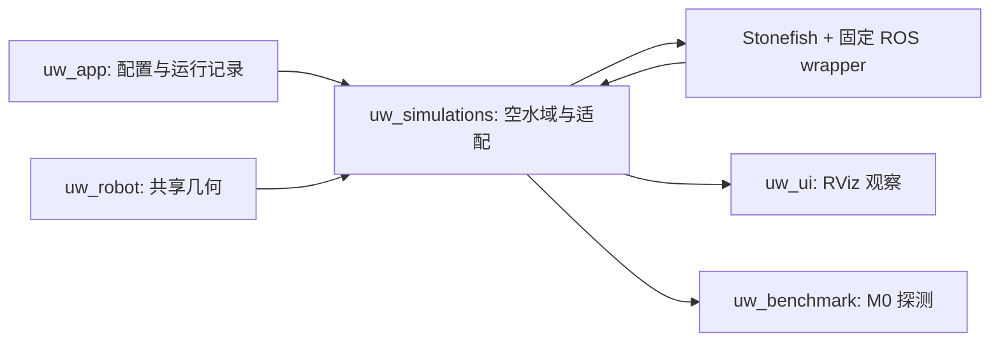
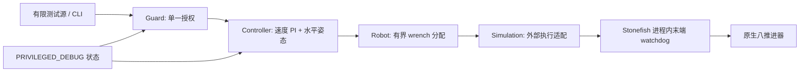
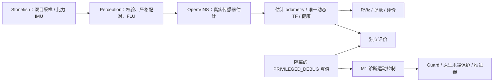
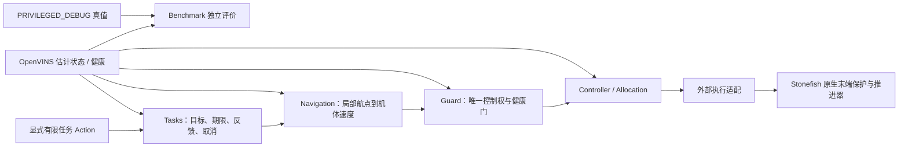

# 架构实施映射

用户提供的完整设计保留在仓库根目录 `underwater-stack-architecture.md`。
本 Vault 记录实施状态和决策，不复制整份设计。

M0 为只观察模式，物理机器人可能漂移/上浮，不承诺定点。
真值由适配器发布到专用话题，并在显式 `PRIVILEGED_DEBUG` 模式中
复制到 `state/odometry`，由同一适配器独占 `odom → base_link`。
机器人发布器仅发布静态几何，不发布动态机体位姿。

在容器中构建固定 underlay `/opt/uw_underlay`，本仓库以只读源挂载，
overlay 输出至 Docker 命名卷 `/work/overlay`。运行数据单独挂载至
`/data`，不挂载整个 home、Docker socket，不使用 privileged。

进程重启是唯一 reset 基线。每次运行生成 UUID 后缀，不复用 DDS 进程、
输出目录、TF 缓存或上一轮状态。尚未提供多 worker 分配器。

M1 在上述观察链路上显式增加 `uw_interfaces`、`uw_guard`、`uw_controller`，
现有 `uw_simulations` 承担最后一个外部执行适配，`uw_robot` 保存几何/映射并实现分配。
`uw_app` 只做配置组装和证据，不实现 PID。脚本只启动包内运行器。

M1 schema 2 与 M0 schema 1 分离；M0 生成场景仍无可驱动订阅入口。
DDS XML、单容器私有 IPC、物理步长和传感器配置沿用已验收值。
详见 [控制器](module-controller.md)、[Guard](module-guard.md)、[M1 运行](runbook-m1.md)。

## M2 显式估计模式

新增根目录 `uw_perception` 和 `uw_localization`，独立 schema 3 与 M2 镜像。
原 M0/M1 组装路径保持原语义。

估计器不订阅 GT；测试控制器继续显式使用 GT，生成可评价的真实物理运动。
M2 未接通估计状态推进器控制，不声称导航通过。固定投影/比力诊断与自由运动
估计分开。接口、源锁和验收边界见 [M2 运行指南](runbook-m2.md)。

## M3 显式导航与任务模式

增加根目录 `navigation/uw_navigation`、`tasks/uw_tasks`，schema 4 和独立 M3
镜像/overlay。M2 的原始诊断真值反馈路径保留；M3 改用真实 OpenVINS 输出。

不增加地图、避障、RL 或实机链路。高层只表达任务目标和四维机体速度；电机
数组留在既有分配/执行层。参数、局部坐标和安全时钟见
[M3 决策](adr-0004-estimated-navigation-and-missions.md)、[Navigation](module-navigation.md)、
[Tasks](module-tasks.md)、[运行指南](runbook-m3.md)。
