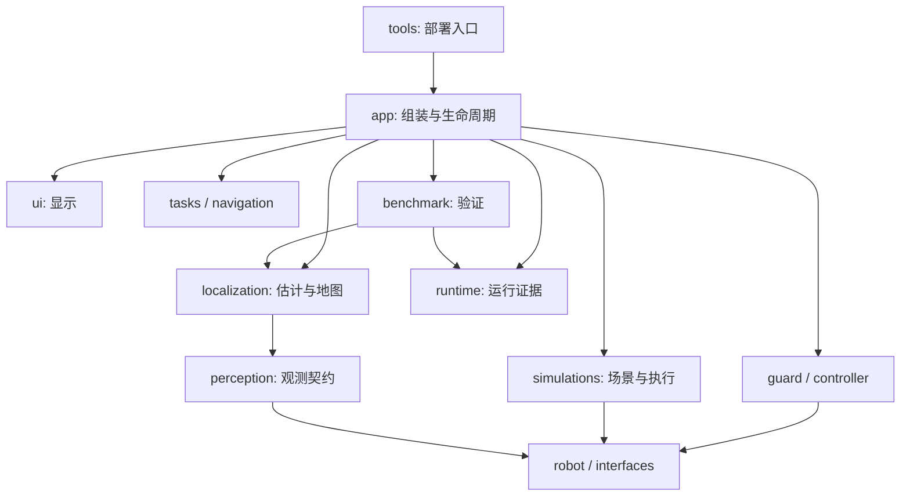

# 模块职责与依赖

13 个实际 ROS 包继续在根目录并列。拆分依据是一起变化的职责，而非语言或技术层。
修改 ORB 相机参数在 localization 完成，调整窗口布局在 ui 完成；两者都不需要
修改控制器或运行配置解析。所有算法与 ROS 依赖在容器中。

| 目录 | 负责 | 不承担 |
|---|---|---|
| `app/` | 运行配置、选择模块、组装节点、进程生命周期 | SLAM 标定、场景 XML、显示布局、控制算法 |
| `robot/` | 机器人描述、FLU/ENU 数学、推进器几何与分配模型 | 启停、命令授权 |
| `interfaces/` | 跨节点消息和服务 | 业务算法 |
| `simulations/` | Stonefish 适配、场景与光学、末端执行保护 | 选择控制任务 |
| `guard/` | 授权、健康与时效、安全包络 | 速度控制和路径规划 |
| `controller/` | 速度/姿态闭环 | GUI、部署、独立评价 |
| `perception/` | 传感器契约、同步与观测整理 | 启动其他模块 |
| `localization/` | OpenVINS/ORB 接入、原生配置、地图文件检查 | 运行入口、UI、控制权 |
| `navigation/`、`tasks/` | 路径反馈与有限任务 | SLAM 内部参数和桌面窗口 |
| `ui/` | RViz 布局、只操作本轮窗口的显示与关闭 | 控制命令、算法实现 |
| `benchmark/` | 测试序列、统计、独立结果判定 | 生产控制算法、app 内部实现 |
| `runtime/` | 唯一运行目录、事件、源码快照与证据写入 | 地图格式、ROS、算法、GUI |
| `tools/` | 宿主环境、镜像构建、资产导入与 CLI 分发 | ROS 节点与算法 |

图示省略部分契约依赖；精确的允许依赖在
[边界测试](../test/test_module_boundaries.py)，实际声明在各包 `package.xml`。
测试同时覆盖包内 Python 与 launch 文件，检查直接导入是否符合职责、是否声明、
是否构成环。`ui` 与 `runtime` 不依赖其他项目包；控制器和 Guard 只依赖
机器人模型与共享接口；benchmark 不能导入控制器实现或 app。

## 复用接口

- `uw_localization.orbslam3.prepare(out, namespace, profile, defaults)`：显式机器人
  标定和默认参数文件生成原生设置，不查找 app 配置或接收包查找回调。
- `uw_localization.rtabmap.prepare(out, namespace, defaults, long_survey=...)`：
  RTAB 参数归其后端所有；地图格式检查在同包 `artifacts`。
- `uw_ui.layouts` 接收模板、namespace 与显示选项；不启动 ROS 或导入算法。
- `uw_simulations.survey_scene.prepare(...)` 接收场景、证据路径及已锁定路线；
  `uw_guard.configuration.route_safety_envelope(route)` 单独负责包络。
- `uw_robot.frames.quaternion_rpy` 是不依赖 NumPy/控制器的共有坐标数学。
- M2/M3 launch 入口导入已安装的 `uw_app.composition.estimation`，不根据
  兄弟文件名加载实现。app 显式传递上述模块所需参数。

包内 `config/` 是模块默认参数；根 `config/` 是跨模块运行请求。新增后端应实现
自己的输入配置与输出契约，再由 app 显式组装，无需修改 Guard、控制器或 UI
内部实现。需要不同显示产品时在 ui 新增对应布局。

`scripts/uw` 继续为薄入口，`vendor/` 只放来源锁和补丁，`resources/` 放外部资产
索引。历史数据不入 Git。原始设计、历史报告及旧 freeze 保留；重构后的实际
验证单独记录，不能用旧 PASS 代替当前运行。
