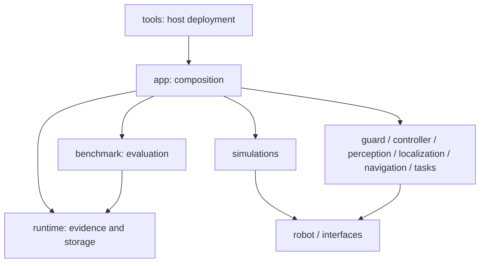

# 模块边界

保留根目录功能包，不搬成多层 backend/src 工程。13 个真实 ROS 包分别承担已有职责；
新增 `uw_runtime` 提取运行证据、唯一目录、源码快照与只读地图检查，不引入算法。
`uw_benchmark.artifacts` 保留兼容导入。

图示表达主要职责，准确依赖由 package.xml 与 Python 导入决定。
纯证据工具不依赖 ROS、app 或 benchmark；底层控制/仿真/感知包不导入 app、
benchmark 或宿主部署工具。ROS 声明图和 Python 导入图都有无环测试。
app 可以组装评价节点，评价工具不能反向依赖 app 的实现。

包内 config 是模块默认值；根 config 是跨模块运行请求，严格 schema 验证。
vendor 仅放来源锁和补丁，第三方源码在容器内获取；resources 放资产索引/哈希。
宿主 tools 负责 profile、构建、数据路径、X11 授权和资产导入。
控制、分配、SLAM、统计公式仍在相应包中。

原始设计保留，但阶段实现以源码与实际记录为准。源工作区没有历史 Git 提交可迁移，
新仓库初始提交包含当前实现；历史报告、freeze 和构建配方保留便于追溯。
大型原始证据仍在原数据根，用 run_id 引用。
