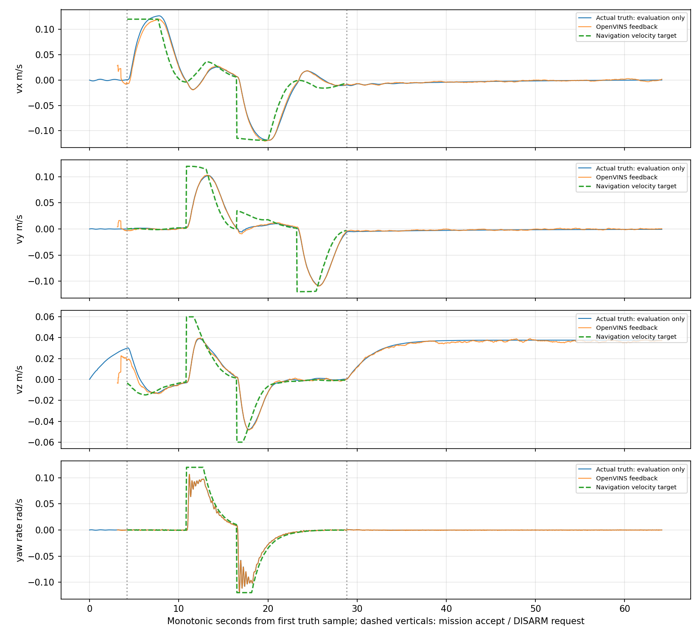
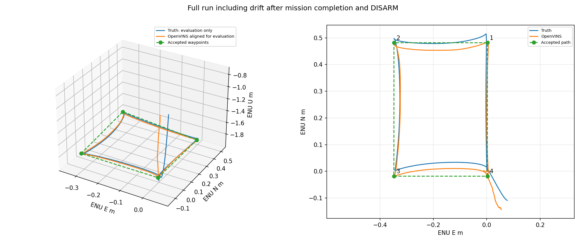
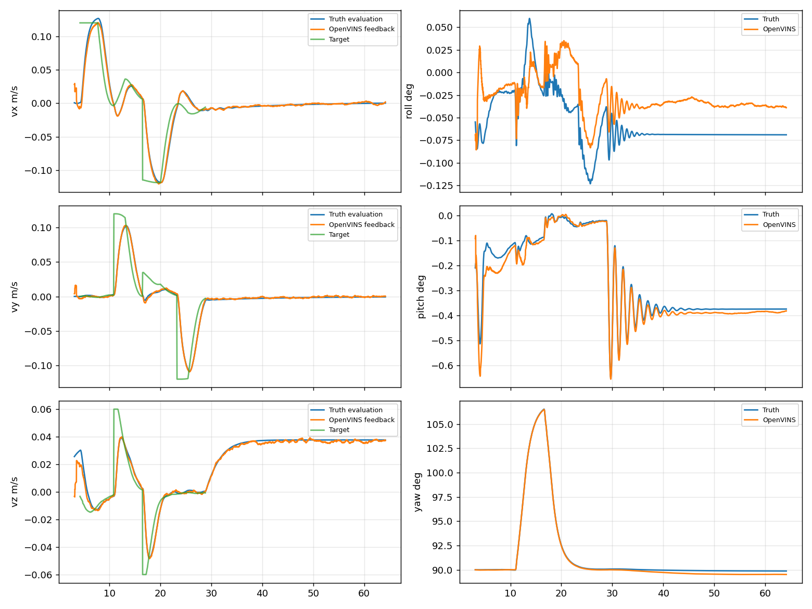
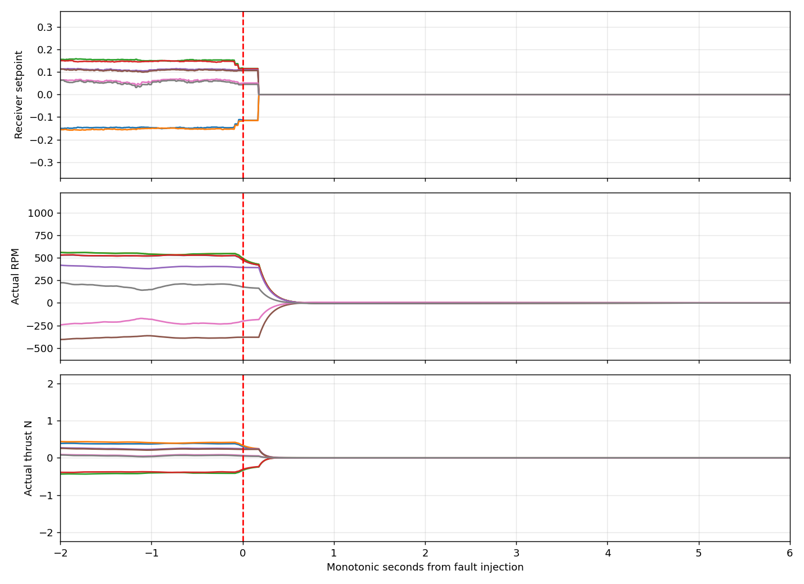
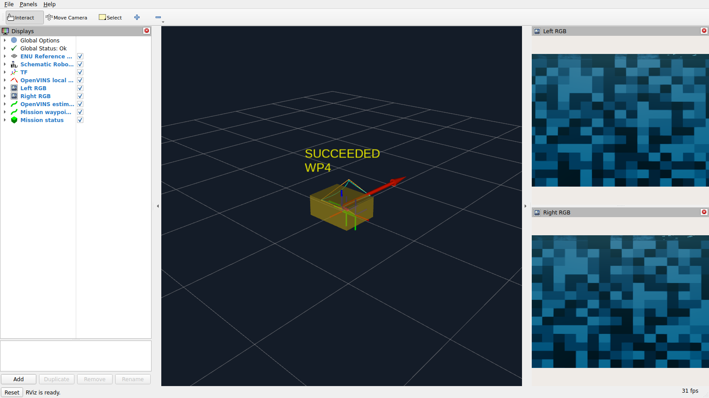
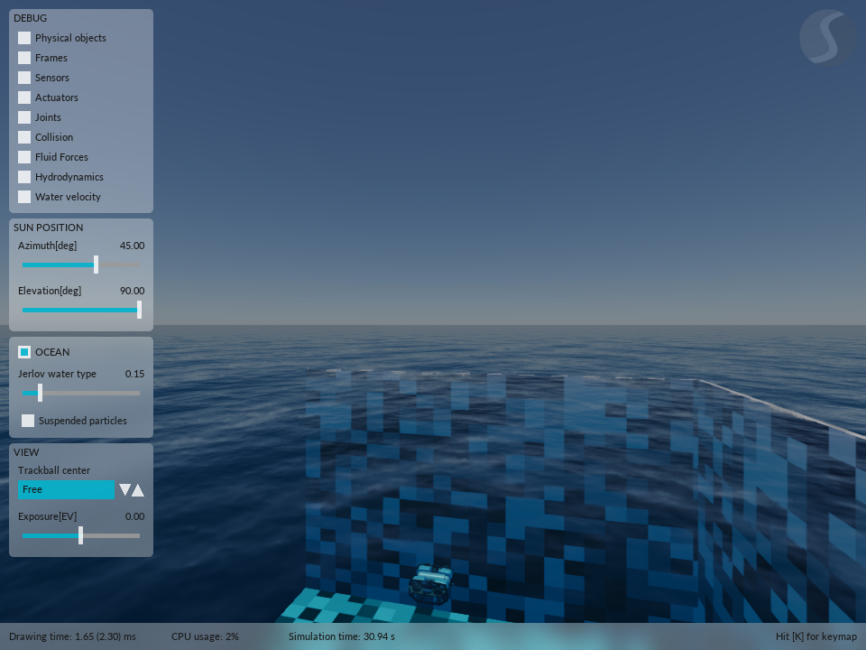

# M3 实现与本机验收：2026-09-23

结论：**M3-v4 在限定仿真场景下通过**。
最终同版 39 项集成评价：39 PASS / 0 FAIL / 0 NOT_RUN。
其中 M3 22 项，M0 两轮、M1 关键链路两项、M2 全清单 13 项回归。
另有同版 CLI 实测，判定 PASS。旧版本和失败轮次不混入最终通过数。

本轮实际完成：OpenVINS 估计反馈 → 有界任务 Action → 局部航点跟踪 →
Guard → 原速度/姿态控制与分配 → Stonefish 原生推进器。状态源为
**OPENVINS_STEREO_IMU**；**PRIVILEGED_DEBUG 只供独立评价**。没有真值回退控制。

## 基线、构建与版本

修改前核对 M2-v3 的 151 个冻结文件、13 个历史正式目录及原镜像；这属于
历史证据复核，不冒充本轮重跑。修改前归档在
`$HOME/.local/share/underwater-stack/reports/m3-baseline-20260923T074903Z/`。
仓库没有 Git HEAD、原文件均未跟踪，因此使用完整源码归档和哈希记录版本，
没有 reset、commit 或 push。原始蓝图、历史验收目录和旧镜像标签均保留。
最终检查发现 M2 历史报告的补丁表格有空白排版变化，内容与补丁哈希未变；
保留该工作区变化，未覆盖回旧文件，差异另存 `reports/m3-preserved-workspace-formatting.diff`。

M3 镜像 `underwater-stack:m3` / `underwater-stack:m3-v4` 的实际本地 image ID：
`sha256:1eb89a2c0925a0d3586b760bd2f6a22c09e1b762b76df136e101a83bb125fa7f`。它继承锁定 M2-v3 镜像；本轮没有新增上游补丁或 APT 依赖。
0001–0008 补丁和来源锁均保持原哈希。v1–v4 使用相同底层镜像，运行代码版本由
`test/m3-freeze.json` 的 181 个文件哈希区分；overlay 每轮显式编译。

实际执行：

```bash
UW_IMAGE=underwater-stack:m3 UW_DOCKERFILE=docker/Dockerfile.m3 ./scripts/uw build
UW_IMAGE=underwater-stack:m3 ./scripts/uw test
./scripts/uw test --local
./scripts/uw m3-acceptance --phase diagnostic --cases timeout
./scripts/uw m3-acceptance --phase formal --cases load contracts missions lifecycle faults ui regression --continue-on-failure
```

12 个项目包实际编译成功；容器 71/71 项测试通过，宿主 63 PASS / 8 SKIP，
跳过项依赖容器内 NumPy/OpenCV。未删除旧 M0/M1/M2 断言。构建/测试日志在
仓库 `.cache/m3-build.log`、`.cache/m3-tests-final.log`、`.cache/m3-local-tests-final.log`；
每个病例的 colcon 与运行日志另存 reports 和各 run。本轮容器 glxinfo 再次确认
NVIDIA RTX 5090、580.178.04、OpenGL 4.6 和 direct rendering Yes。

DDS XML 保持原哈希 `ca6961088346410f2e4770396caecb17ade8848974bfa6b427a31d7d307f53f7`：
32 MiB/participant、4 MiB 最大消息、1024 槽、关闭内建传输、SYSTEM_DEFAULT。
仍是单容器私有 IPC、512 MiB /dev/shm、单仿真单 /clock；M3 domain 44。

## 功能与判定边界

- 根目录新增 `navigation/` 与 `tasks/`，没有复制第二套工程。
- `mission/execute` 提供显式授权、反馈、取消、超时及成功/取消/失败终态；普通启动 DISARMED。
- 接单时的 `mission_start` 相对目标一次数值转换到局部 odom；支持 odom 绝对目标。
  不把估计器的自由偏航规范当成全球北向。水平姿态仍由原控制器稳定。
- 20 Hz 航点跟踪，水平速度 0.12 m/s、竖直 0.06 m/s、偏航率 0.12 rad/s；
  到点要求位置 <0.06 m、偏航 <0.10 rad、速度足够小且持续 1 秒。
- Guard/Controller/Navigation/Tasks 不订阅真值；Guard 独立检查估计健康/传感器时效。
  READY_STATIC 与首次视觉更新后的 TRACKING 分开，M2 原默认行为保留。
- 任务心跳的原签发时间保留；`valid_until_steady_ns` 单独收紧绝对期限，
  Guard 的 0.25 s 请求期限和原生 0.20 s 输出 watchdog 不放宽。
- Action 客户端死亡不自动撤销已接单任务，任务服务器仍执行有绝对期限的意图；
  CLI Ctrl+C 或 mission-cancel 明确取消。任务服务器死亡有独立真实故障测试。

## 三次独立冷启动任务

同一场景、同一冻结版本，每次重新启动进程。不是不同随机种子或场景泛化。
输入为相对起点 `(0.4,0,0,0)` → `(0.4,0.3,0.12,0.3)` → `(0,0,0,0)`。
位置/yaw 真值评价只做首次共同样本的平移和偏航规范对齐，不拟合尺度或整段轨迹。

| 重复 | 结果 | 全段估计位置 RMSE m | 三个实际到点误差 m | 最大实际到点偏航误差 rad | 请求年龄 P95 s |
|---|---|---|---|---|---|
| 1 | PASS | 0.0269 | 0.0433 / 0.0302 / 0.0276 | 0.0186 | 0.0718 |
| 2 | PASS | 0.0304 | 0.0318 / 0.0262 / 0.0224 | 0.0181 | 0.0788 |
| 3 | PASS | 0.0279 | 0.0413 / 0.0297 / 0.0264 | 0.0170 | 0.0848 |

所有成功航点/负载病例的最大真实到点误差为 0.0433 m，门槛保持 0.15 m。
还覆盖 ENU 初始 yaw=0°、跨进程旧请求重放、竞争任务拒绝、8 类非法任务、
未就绪拒绝、取消和绝对任务超时。完整病例逐项列于下表。

## 最后一跳与故障

所有注入在非零实际推进器设定值下进行；SIGKILL 只针对当前 run 注册 PID，
检查 start_ticks。状态/图像/IMU中断时 Benchmark 不主动 DISARM 来替代健康门。
暂停/回跳采用原隔离 fixture，没有向正常域发布第二个 /clock。

| 注入 | 判定 | 注入至原生接收设定值中和 s |
|---|---|---|
| fault_tasks | PASS | 0.251158 |
| fault_navigation | PASS | 0.215858 |
| fault_guard | PASS | 0.214164 |
| fault_controller | PASS | 0.203169 |
| fault_actuator_adapter | PASS | 0.176912 |
| fault_localization | PASS | 0.190646 |
| fault_images | PASS | 0.215508 |
| fault_imu | PASS | 0.195567 |
| fault_clock_pause | PASS | 0.000950 |
| fault_clock_rewind | PASS | 0.003198 |

最大中和延迟 0.251158 s，冻结门槛 0.50 s。
原生反馈另存 actual RPM / thrust 衰减；中和不等于机器人立即静止。
恢复消息/旧请求重放后没有自动重新 ARM。故障锁存、任务结果、进程退出码分开记录；
预期死亡的 -9 没有改成 0。RViz SIGKILL 后任务仍成功，核心控制与 UI 分离。

## 图形负载、回归和 CLI

两轮 M3 各有 60 秒观测，保留双目、RViz、压缩 debug MCAP 和真实截图。
窗口包含完整任务及 DISARM 后的真实漂移；不称为 60 秒持续运动或位置定点保持。
控制年龄 P95 继续使用 0.15 s 门槛，观测使用原 M0 的 2 秒墙钟/1 秒 ROS 新鲜度门槛。
左右 M3 图像是 M2 严格配对输出；M0 原相机采样不要求数量相等。

M0 原观察配置两轮各 60 秒、RViz 与原 debug bag；无推进器控制入口、唯一时钟、
TF、新鲜度和正常退出按原门槛检查。独立 graph-inspection 均为 1 个时钟发布者、0 个电机话题；
MCAP 首个时钟均 0.02 s，初始位置均约 ENU (0,0,-2)，真实左右图像已导出。M1 重跑正 vx 和末级 Adapter SIGKILL 两项，
这是关键链路回归，不冒充重新执行历史 54 项完整清单。M2 原 13 项全部重跑，
仍明确使用真值诊断控制；这些回归由 M3-v4 冻结清单统一约束，不冒称重跑旧源码。

实际 CLI 证据：`m3_manual--20260923T091332Z--a422200ee824/manual-cli-evidence.json`。
执行两点任务成功、独立 cancel 返回 CANCELED 并确认中和、连续 8 次状态查询成功。
取消任务的客户端退出码 1 按原语义保留；仿真必要进程正常退出。

## 最终全部病例（39 项）

目录根：`$HOME/.local/share/underwater-stack/runs/`。

| 病例 | 判定 | run_id |
|---|---|---|
| load_1 | PASS | `m3_formal_load_1--20260923T084546Z--bd899633b92b` |
| load_2 | PASS | `m3_formal_load_2--20260923T084702Z--a3028a7ef0fc` |
| bootstrap | PASS | `m3_formal_bootstrap--20260923T084818Z--13f0bb8b465c` |
| invalid_goals | PASS | `m3_formal_invalid_goals--20260923T084842Z--509c60c8c813` |
| mission_1 | PASS | `m3_formal_mission_1--20260923T084906Z--9725838765dd` |
| mission_2 | PASS | `m3_formal_mission_2--20260923T085010Z--49272b8570cc` |
| mission_3 | PASS | `m3_formal_mission_3--20260923T085115Z--5ea7a7b21dbf` |
| rotated | PASS | `m3_formal_rotated--20260923T085219Z--4a48ac9cc654` |
| restart_replay | PASS | `m3_formal_restart_replay--20260923T085303Z--af5581544824` |
| cancel | PASS | `m3_formal_cancel--20260923T085348Z--817d46ad4bc5` |
| timeout | PASS | `m3_formal_timeout--20260923T085417Z--716b0108a0ca` |
| fault_tasks | PASS | `m3_formal_fault_tasks--20260923T085441Z--1d4eb84945bc` |
| fault_navigation | PASS | `m3_formal_fault_navigation--20260923T085510Z--338f5f72a56b` |
| fault_guard | PASS | `m3_formal_fault_guard--20260923T085540Z--031627011800` |
| fault_controller | PASS | `m3_formal_fault_controller--20260923T085609Z--6fa62c018c87` |
| fault_actuator_adapter | PASS | `m3_formal_fault_actuator_adapter--20260923T085638Z--21c2401e0ec7` |
| fault_localization | PASS | `m3_formal_fault_localization--20260923T085707Z--4cbc06ad9a8e` |
| fault_images | PASS | `m3_formal_fault_images--20260923T085737Z--82f529284fe3` |
| fault_imu | PASS | `m3_formal_fault_imu--20260923T085806Z--4e418b1fc643` |
| fault_clock_pause | PASS | `m3_formal_fault_clock_pause--20260923T085835Z--8940c21f89cb` |
| fault_clock_rewind | PASS | `m3_formal_fault_clock_rewind--20260923T085904Z--919b1e099f58` |
| fault_rviz | PASS | `m3_formal_fault_rviz--20260923T085933Z--3c869d3f56a9` |
| m0_1 | PASS | `bluerov_empty_water--20260923T090017Z--57ddab05a3f0` |
| m0_2 | PASS | `bluerov_empty_water--20260923T090129Z--62b828efb41e` |
| m1_velocity | PASS | `m3_formal_m1_velocity--20260923T090240Z--247295e13c8c` |
| m1_watchdog | PASS | `m3_formal_m1_watchdog--20260923T090316Z--d334196bef35` |
| m2_calibration | PASS | `m3_formal_m2_calibration--20260923T090335Z--db4933521cf0` |
| m2_imu_tilt | PASS | `m3_formal_m2_imu_tilt--20260923T090402Z--6d3437c9dd0e` |
| m2_trajectory_1 | PASS | `m3_formal_m2_trajectory_1--20260923T090428Z--60e523f56567` |
| m2_trajectory_2 | PASS | `m3_formal_m2_trajectory_2--20260923T090525Z--5dab96961bed` |
| m2_trajectory_3 | PASS | `m3_formal_m2_trajectory_3--20260923T090621Z--639640a96c80` |
| m2_empty_water | PASS | `m3_formal_m2_empty_water--20260923T090717Z--224ef591eec0` |
| m2_image_dropout | PASS | `m3_formal_m2_image_dropout--20260923T090748Z--f6f820c0c991` |
| m2_imu_dropout | PASS | `m3_formal_m2_imu_dropout--20260923T090828Z--94b5372d73ec` |
| m2_clock_pause | PASS | `m3_formal_m2_clock_pause--20260923T090907Z--3ecd993a63c6` |
| m2_clock_rewind | PASS | `m3_formal_m2_clock_rewind--20260923T090946Z--f1cbd044dcbe` |
| m2_estimator_kill | PASS | `m3_formal_m2_estimator_kill--20260923T091025Z--1a754bb40f61` |
| m2_load_1 | PASS | `m3_formal_m2_load_1--20260923T091105Z--da38c3c2aa6e` |
| m2_load_2 | PASS | `m3_formal_m2_load_2--20260923T091218Z--12a87e2b8be3` |

## 失败与版本演进（全部保留）

1. 首次启动使用了 rclpy.Node 的保留属性 handle，节点构造失败；改为 mission_handle。
2. 首次绝对 yaw=0 调试导致相对初始规范约 180° 的大转向，VIO 后续发散，Guard 撤权，
   该次任务 FAIL。引入明确的 mission_start 相对坐标避免无意的大转向；不宣称修复了
   VIO 的所有大转向或视觉混淆问题。
3. CLI 实测先后发现测试器提前发任务（服务器正确拒绝）及短命参与者的 SHM 容量边界。
   保留原 DDS，增加有限启动容量检查；状态查询改读 Guard 原子快照。
4. v1 两轮负载的数值检查 PASS，但实际 RViz Marker 订阅错误，复核不接受；v2 修复
   订阅后仍发现长状态文本裁切，改成短文本。旧结果保留，不计入最终通过数。
5. v3 超时病例实际 ABORTED/中和成功，但请求年龄 P95 0.155280 s 超过 0.15 s，保留 FAIL。
   原实现为表达绝对期限而前移签发戳；v4 改为独立期限字段，原签发时间不变。
   不改门槛、不裁掉末段统计，重新运行最终全清单。

全部调试、早期冻结和最终运行见 [运行索引](m3-run-index.md)。每个新版本重新冻结；
最终结果没有拼接早期最好值。原 M0/M1/M2 历史报告未回填新能力。

## 证据与图表

每轮保存源码归档/哈希、镜像 ID、父锁/补丁锁、DDS、解析配置、映射/模型与控制增益、
生成场景、URDF、授权/状态/执行反馈、过程/故障事件、真实退出码及 bag metadata。
最终审计：`reports/m3-v4-final-evidence-audit.json`；统一清单：
`reports/m3-formal-aad526e882.json`。新增运行数据 13.07 GB / 25 GB 预算。
原始 probe 的 unverified 不被改写。








速度/轨迹派生图来自最终 load_1 原始 JSONL，脚本及原文件哈希保留在
`reports/m3-v4-derived/`，没有改写原 metrics。窗口图来自实际 X11 截图，
相机样本来自真实 ROS Image；不以“看起来移动”作为控制通过依据。

## 独立结论与限制

- 正常导航/估计闭环：PASS，限定带纹理、已知空闲、低速局部航点。
- 最后一跳失联保护：实际反馈和物理继续推进证明，独立于外层 Python 的退出回调。
- M0 回归：按原观察语义独立评价；M1/M2 回归和导航结论不互相替代。

尚无避障、全局规划/地理航向、持久地图、RL、多机器人、多 worker、ArduSub 或实机。
VIO 健康判定不覆盖所有误匹配/协方差一致性；大转向、无纹理水域或更高负载不在本次
导航通过范围。这里只承诺进程冷启动，不承诺热重置、逐位可重复或真实水下安全。

详细实现范围见 [文件清单](m3-file-changes.md)，使用见 [运行指南](runbook-m3.md)，
决策见 [ADR](adr-0004-estimated-navigation-and-missions.md)。没有自动进入 M4。
