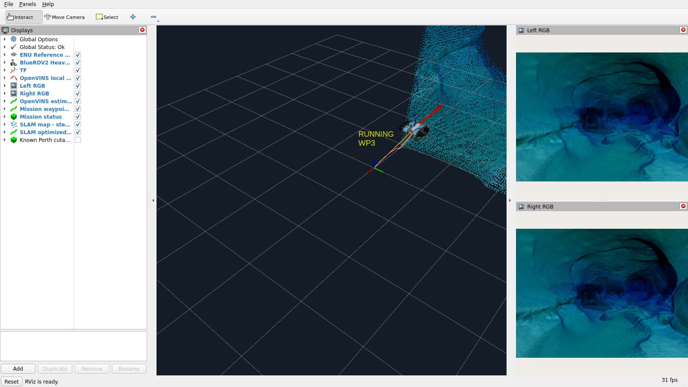
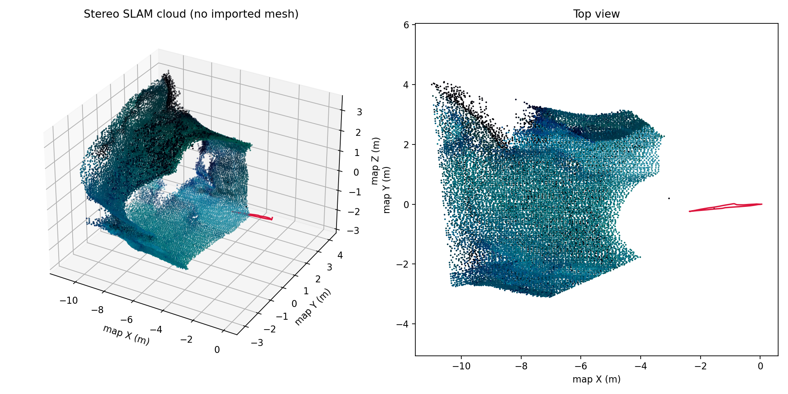
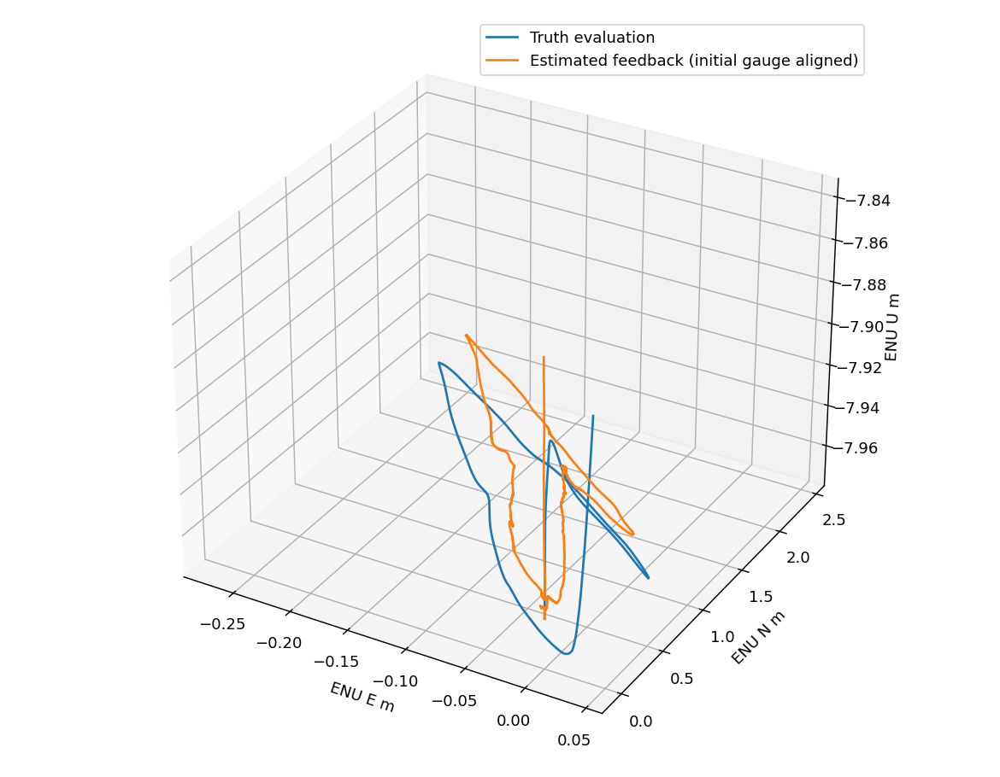
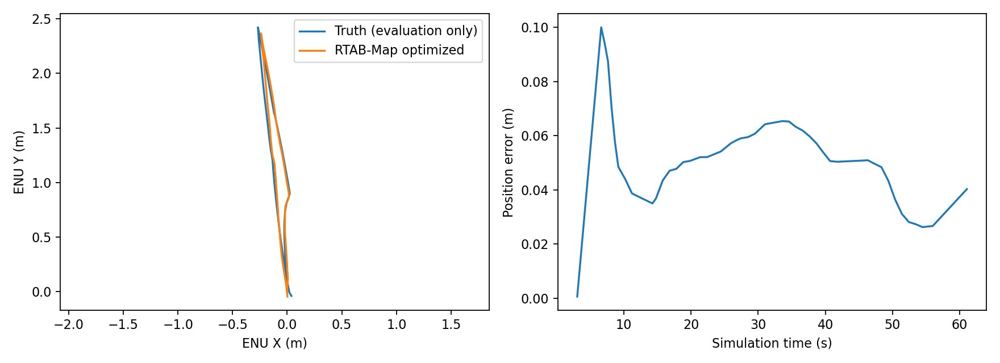

# Porth 场景 SLAM 本机验证：2026-09-24

结论：**现有 Stonefish 仿真内，Porth 双目/IMU → OpenVINS → RTAB-Map
建图链路已真实跑通**。BlueROV2 沿短预设路径运行，RViz 显示真实机器人、
轨迹与传感器生成的地图；观察到回环匹配，数据库可重新打开并导出地图。
这不是自主探索/避障验收，也不覆盖整座洞穴。

日期为本机 Asia/Shanghai；run_id 采用 UTC。历史 M0/M1/M2/M3 报告仅作为
基线引用，下表为本轮新运行。先读文件并归档，随后实现、构建和运行，
修改前归档在 `reports/porth-baseline-20260923T183225Z/`。

## 实现和边界

- 导入本机 Porth Sump 9 完整视觉网格、碰撞网格、真实岩壁纹理和来源 metadata。
  选择 1.5 倍实验尺度；未宣称原始测量尺度已经标定。短路径中心到碰撞表面
  筛查下界 2.098 m，机器人筛查半径 0.50 m。没有运行避障规划。
- 出生 ENU `(0,0,-8)`、yaw=90°，保留自由刚体、水动力和真实原生推进器。
  双目、IMU、控制增益和物理步长不变。单独加入静态照明 fixture 和显式水体
  光学参数，不宣称灯光/传感器实机等价。
- 控制反馈仍是 OpenVINS；独立真值仅用于误差与安全包络评价，未送入估计器
  或 RTAB-Map。`graph-inspection.json` 检查真值订阅隔离。
- RTAB-Map 用双目与外部里程计建立关键帧、三维地图和回环约束；发布 map→odom。
  OpenVINS 独占 odom→base_link。旧控制仅消费 odom，不把回环跳变送入控制环。
- 普通启动保持 DISARMED；`--arm` 显式授权既有任务链路。5 个航点完成后
  实际中和、DISARM。v2 在任务结果后再观察 5 秒退出，避免长时间断推力上浮。
  v1 保留了 140 秒观察全过程，未裁剪成 v2 的最好片段。
- RViz 使用锁定上游的真实 BlueROV2 网格，数值转换 FRD→FLU，传感器外参不变。
  已知洞穴去顶网格默认隐藏；它不是 SLAM 输出，物理场景仍用完整网格。

独立镜像 `underwater-stack:m3-porth-v1` 实际 ID：
`sha256:6c0e219da38c1316ce364508baa9bf8375ed60e62f6f0d375e9774a2bd3e44fa`。
父镜像为已验收 M3-v4，ID `sha256:1eb89a2c0925a0d3586b760bd2f6a22c09e1b762b76df136e101a83bb125fa7f`。
RTAB-Map ROS 包固定 0.23.7 的具体 Jazzy APT 版本，见
[来源锁](../vendor/source-lock.porth.yaml)，传递依赖清单保存在每轮
`porth-dpkg-packages.txt`。没有新增上游源码补丁，也没有覆盖历史镜像标签。
独立 overlay，DDS SHA-256 仍为
`ca6961088346410f2e4770396caecb17ade8848974bfa6b427a31d7d307f53f7`。

## 全部路径运行

以下路径均相对于 `$HOME/.local/share/underwater-stack/runs/`。
3 次独立冷启动全部 PASS；v2 的两次重复使用相同算法、增益、映射和结束规则。
这些是重复运行，不是不同随机场景的泛化测试。

| run_id | 结果 | 墙钟时长 | 位姿图节点峰值 | 导出实时点云 | 回环报告次数 | VIO 位置 RMSE | 最大实际到点误差 |
|---|---|---:|---:|---:|---:|---:|---:|
| `porth_path_v1--20260923T185358Z--eaae94d00ba7` | PASS | 154.66 s | 77 | 77,821 | 50 | 0.0706 m | 0.0875 m |
| `porth_path_v2--20260923T185713Z--e2ff11b37774` | PASS | 71.17 s | 47 | 59,002 | 14 | 0.0550 m | 0.0794 m |
| `porth_path_v2_repeat--20260923T190141Z--f62dee1e6e0b` | PASS | 71.58 s | 48 | 56,624 | 14 | 0.0512 m | 0.0538 m |

每轮 5/5 航点完成，末端中和得到原生反馈，14 个进程退出码均为 0。
v2 两轮包含 RViz、左右图像和完整 debug bag；v1 录制 sensors。
没有关闭图像来避免负载。不同点数是实际图像/时序与关键帧筛选差异。
回环次数指 `Info.loop_closure_id > 0` 的报告数，不等同独立闭合路线数量。

评价配置在 [porth-acceptance.yaml](../test/porth-acceptance.yaml)，与原 M3
正式清单分开。全段 VIO/姿态/速度误差、每个到点误差、控制时效见各轮
`m3-metrics.json`；地图检查单列 `slam-metrics.json`。原 M3 probe 的
`unverified: mapping` 原样保留，没有修改它来冒充已有建图验收。

## 数据库重新读取

3 次路径运行分别使用新的 `reports/slam-export-*/` 目录复制数据库，运行
真实 `rtabmap-info` 和 `rtabmap-export`；全部 PASS，原数据库哈希未改变。
关键帧图像、双目数据、标定、位姿和约束实际落盘，SQLite integrity_check=ok。

v2 第一次的重读地图优化轨迹与真值对照：47 点，位置 RMSE 0.0590 m，最大
0.1048 m。v2 重复的对照：47 点，RMSE 0.0541 m，最大 0.1000 m。
使用首次 VIO yaw/平移配准，未用全轨迹最佳拟合。真值仅进入独立评价。
数据库导出可能处理最后的额外关键帧，点数不要求等于退出前实时点云快照。
**没有执行新会话传感器重定位，也未校验全洞穴地图精度。**

## 失败与回归

失败保留，未覆盖：

1. `porth_static_v1--20260923T185144Z--61059e11ed98`：随体灯光作为额外 actuator
   被已有末端保护拒绝，Stonefish -6。修复为场景固定灯，不放宽末端保护。
2. `porth_static_v1--20260923T185229Z--fa445828851c`：真实建图检查 PASS，但
   退出流程对正在保存数据库的 RTAB-Map 重复发送 SIGINT，实际退出 -2，
   整轮 FAIL。修复后等待各进程完成，三轮路径运行正常退出。
3. `porth_static_v1--20260923T190351Z--193d7c707ef0` 与
   `porth_static_v1--20260923T190641Z--0c685e249046`：补充 TF 消息来源检查时，
   误用了当前 Jazzy Python 未提供的 MessageInfo GID 接口，评价进程分别因
   AttributeError/KeyError 退出 1，整轮 FAIL。已经移除此错误接口调用。
   最终 probe 如实检查 `map_tf_received` 并保存 ROS 图中的 TF 发布端点；
   逐条 map TF 的 GID 校验标记 NOT_AVAILABLE_IN_THIS_RCLPY，不声称已测。
   早期 `single_map_tf` 字段仅验证边存在，不能单独证明逐消息发布身份。

最终未解锁复测 `porth_static_v1--20260923T190801Z--e73c53f0ea3e`：
PASS，连续 25 秒观察，始终 DISARMED，生成 30,797 个地图点并正常退出。
修正后的 TF 检查和实际发布端点写入该轮 `slam-metrics.json`。
合计本轮真实仿真 9 次：5 PASS（3 路径、1 未解锁、1 M0），4 FAIL 如上，
没有把失败的调试轮次剔除或改写。另有 3 次独立数据库重读 PASS。

原 M0 配置重新运行一次 60 秒：
`bluerov_empty_water--20260923T185920Z--7d2d6c43ed29`，SUCCEEDED / PASS。
含 RViz 与原 debug bag；控制关闭、原观测新鲜度/TF/时钟/禁用输入断言保持。
本轮不是历史 M0 两次验收的重写，也未重新执行 M1–M3 全部历史正式清单。

构建命令、普通启动/显式 ARM、取消、导出及回退见 [运行指南](runbook-porth-slam.md)。
新增 3 项契约检查，加上原 71 项；容器运行覆盖全部 74 项，宿主本地检查保留
原 8 项依赖不足的跳过。最终日志位于仓库 `.cache/porth/`。

## 本轮真实图形证据

下列图片为 v2 重复运行的真实截图或实际数据绘图，未经合成；
[provenance.json](assets/porth-slam/provenance.json) 记录原路径和 SHA-256。

[已知洞穴参考网格显示截图](assets/porth-slam/rviz-known-asset.png) 单独列出，
避免与 SLAM 输出混淆。原始运行内保留传感器样本、bag、JSONL、完整日志、
源码归档/dirty 状态、镜像和资产锁、控制参数、执行反馈、进程退出记录。

## 文件范围与局限

新增：`simulations/uw_simulations/porth_assets.py`、`porth_scene.py`（资产/场景），
`app/uw_app/porth.py`（SLAM 组装与持久化检查），
`benchmark/uw_benchmark/porth_case.py`、`slam_export.py`（真实运行评价与重读），
`config/run.porth.yaml`、`localization/config/rtabmap_stereo.yaml`、
`test/porth-acceptance.yaml`、`test/test_porth.py`、Dockerfile 与来源锁及本组文档。
修改：原共享 launch/runner 的显式洞穴分支、M3 配置校验、Guard 的可配置位置
包络（旧默认不变）、独立 mesh URDF、Benchmark 注册与辅助评价、CLI 和包依赖。
**新增上游补丁：无。** 详细机器可读差异清单与最终源码归档另存本轮报告目录。

工作区原本无 Git HEAD，文件均未提交；未 reset、commit 或 push，原蓝图保持。
宿主没有安装 ROS/算法依赖，没有改驱动、权限、shell 或其他项目容器。

仍未完成：自主探索、避障、全局路径规划、新会话重定位、整个洞穴覆盖、地图
测量精度验收、实机与真实水下传感器验证。运行证据支持此局部场景中的 SLAM
连通性、回环报告、持久建图与受控数据采集，不构成完整自主水下导航验收。
