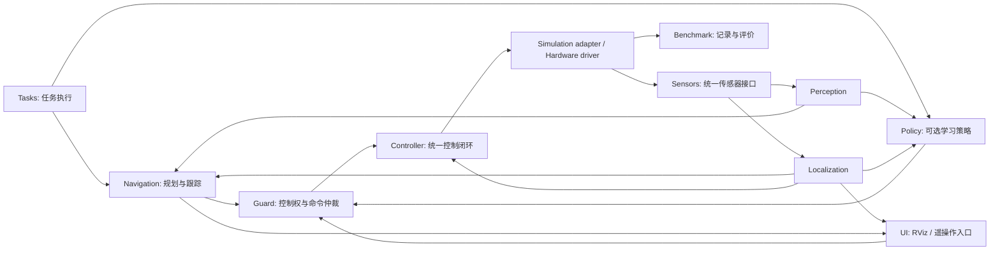

# Underwater Stack：扁平、可扩展的水下机器人研发架构

> **交付状态：架构设计，不是已经跑通的仿真工程。**
> 本方案基于已读取的上游源码设计。目录骨架、编辑器设置和文档可以使用；ROS 包、运行器、控制器、RViz 自定义面板及仿真接口仍需实现和验收。包名、topic、配置字段均属于本项目拟定的契约，除明确指出的上游内容外，不是声称上游已有这些接口。

## 1. 总体决定

项目暂称 `underwater-stack`，自有 ROS 包统一使用 `uw_` 前缀。

采用 **一个 Git 仓库 + 根目录并列的 ROS 2 功能包 + 固定版本的上游依赖 + 容器化运行环境**。文档使用 `docs/` 作为独立 Obsidian Vault。RViz2 作为可视化与调试客户端；ROS 2 节点和 Stonefish 是运行与仿真后端。RViz 官方将其定义为 ROS 2 的三维可视化工具，而非物理引擎。[S4]

不额外搭建 Web 前端、REST 后端、数据库、消息队列或 Kubernetes。它们不是这套机器人平台的先决条件。可扩展性的重点是模块边界、接口和配置，而不是一开始增加更多服务。

初期使用独立的 Ubuntu 24.04 / ROS 2 Jazzy 容器环境，不与既有 Gazebo、Isaac 或 ROS 1 工作区叠加。宿主不安装本项目的 ROS、Stonefish、colcon 或 Python 算法依赖，不修改宿主全局 shell 配置。宿主编辑器、Obsidian 与必要 Docker/GPU 支持不属于算法运行依赖。

## 2. 上游核查结果与采用方式

已读取 `bvibhav/stonefish_bluerov2` 的 README、启动文件、机器人场景与 ArduSub 桥接。README 声明测试环境为 Ubuntu 24.04 / ROS Jazzy，并要求 Stonefish 与 `stonefish_ros2` 使用 `v1.3` 以匹配场景文件；这属于上游作者的测试说明，不等于本架构已在你的设备通过验收。[S1]

本次解析到的版本如下，适合作为**初始候选锁定版本**，还需完成本地构建与运行验证：

| 组件 | 参考版本 | 完整提交 |
|---|---|---|
| stonefish_bluerov2 | 检查时的 master | `6448383af6b7ef6083b0eac2c08102660591e318` |
| stonefish | v1.3 | `6d285a955d19c9ecef3defd3f0605907f4594dbb` |
| stonefish_ros2 | v1.3 | `3fc1fc7e9f959f988cd3e9c71fcf7944163abd0d` |

完整锁定还应包含镜像 digest、系统包版本、Python 依赖、补丁哈希。上面三项不能独自证明环境完全可复现。[S2][S3]

### 2.1 不把上游仓库改成所有功能的容器

自有仓库维护适配层、控制、感知、导航和实验。上游源码由 `vendor/` 中的锁定清单定位，在容器构建缓存或工作区外部拉取；不要将全部第三方源码复制进自有 `src/`。

`vendor/` 只跟踪版本清单、来源记录和必要补丁。Stonefish C++ 库单独构建安装；ROS 上游包构成固定 underlay；本仓库根目录的自有包作为 overlay 构建。对上游的修正采用可审查补丁或固定的 fork 提交，不在下载缓存中手工修改后遗忘。

### 2.2 需要封装的实际细节

上游 `launch/bluerov2_sim.py` 同时启动 Stonefish 与 `ardusim_patch.py`，并默认选择 `bluerov2_tank.scn`。自己的研究控制模式不能直接照搬这个启动入口，否则可能同时启动另一个推进器命令来源。[S5]

桥接代码对 BlueROV2 取八个 PWM 通道，转换为 `(pwm - 1500) / 400` 后发布到 `setpoint/pwm`。因此这个话题的命名不能被解读为“应直接写入 1500 微秒”。自有标准接口应明确归一化命令及通道名称，再由适配层转换。[S6]

机器人场景中存在左右 camera 配置；RGB/depth、灯光控制、CameraInfo、双目同步与外参一致性仍要逐项验收，不能把场景文件中出现传感器名称等同于整条感知链路已通过测试。[S7]

初始自己的场景为 `empty_water`，只保留 BlueROV2 与水环境。不要直接把上游 tank/seabed 场景作为空水域，也不在初始阶段导入洞穴、海底地图或其他机器人。[S8]

## 3. 根目录：按机器人功能组织，不按语言组织

```text
underwater-stack/
├── app/              # App：系统组装、launch、运行模式
├── interfaces/       # Interface：公共契约及必要的 msg/srv/action
├── robot/            # Robot：BlueROV2 描述、外参、推进器与模型来源
├── simulations/      # Simulations：Stonefish 适配、场景、仿真生命周期
├── controller/       # Controller：速度/姿态闭环、wrench、推进器分配
├── guard/            # Guard：控制权、命令仲裁、超时和安全状态
├── perception/       # Images：传感器预处理、同步、视觉几何
├── localization/     # Context：状态估计适配与健康信息
├── navigation/       # Routes：规划、局部避障、轨迹跟踪
├── tasks/            # Tasks：任务目标、任务状态机与终止条件
├── ui/               # Ui：RViz 配置；以后再增加自定义面板
├── benchmark/        # Benchmark：运行实验、采集、评价、统计
│
├── config/           # Config：跨模块运行组合与实验清单
├── docker/           # Docker：镜像与部署配置
├── docs/             # Obsidian：文档 Vault
├── resources/        # Resource：资产索引、来源、标定记录、校验清单
├── scripts/          # Scripts：薄命令入口与维护工具
├── test/             # Test：跨模块验收规范与集成测试
├── vendor/           # Repository：上游锁定、来源与补丁
├── .vscode/          # Vscode：项目编辑器设置、图标关联
├── README.md
├── AGENTS.md
├── .editorconfig
└── .gitignore
```

图中的文字是**选用的图标标签**。例如 `navigation/` 显示 Routes，`localization/` 显示 Context，不需要为了图标把定位源码命名为 `context/`。Material Icon Theme 支持文件夹名与图标的自定义关联。[S9]

后续首次出现明确需求时，再增加根目录同级包：

| 新目录 | 图标 | 职责 |
|---|---|---|
| `drivers/` | Connection | 实机传感器、ArduSub 与硬件通信适配 |
| `mapping/` | Mappings | 在线地图构建、融合、查询与地图版本 |
| `policy/` | Policy | 学习策略推理；训练代码和重型依赖在内部与在线推理解耦 |

不预建二十个空算法目录，不使用 `backend/src/modules/robot/...`，也不同时创建 `core/`、`shared/`、`lib/`、`utils/` 四个含义重叠的公共目录。只有出现至少两个真实使用方、稳定公共接口和维护责任时才提取共享库。

## 4. 扁平不等于把所有文件放在根目录

业务模块在根目录并列；包内部遵循语言和 ROS 构建规范。**目录名、ROS 包名与 Python 导入名是三个层次。**

| 根目录 | 计划的 ROS 包名 | 实施阶段 |
|---|---|---|
| app | uw_app | M0 |
| interfaces | uw_interfaces | M0；没有自定义消息需求时先维护契约 |
| robot | uw_robot | M0 |
| simulations | uw_simulations | M0 |
| ui | uw_ui | M0 |
| benchmark | uw_benchmark | M0 起，先做记录与诊断 |
| guard | uw_guard | M1，首次允许自动控制之前 |
| controller | uw_controller | M1 |
| perception | uw_perception | M2 |
| localization | uw_localization | M2 |
| navigation | uw_navigation | M3 |
| tasks | uw_tasks | M3 |

C++ 包可以采用：

```text
controller/
├── package.xml
├── CMakeLists.txt
├── include/uw_controller/
├── src/
├── config/
├── test/
└── README.md
```

Python 包可以采用：

```text
navigation/
├── package.xml
├── setup.py
├── setup.cfg
├── resource/uw_navigation
├── uw_navigation/
│   ├── __init__.py
│   ├── planner_node.py
│   └── tracker.py
├── config/
├── test/
└── README.md
```

这里的包内 `resource/uw_navigation` 是 ament 索引标记，不等于仓库根目录管理资产的 `resources/`。

根目录不放把整个仓库声明成一个 ROS 包的 `package.xml`。colcon 可以对明确的路径进行非递归包发现，也可使用 `--base-paths` 递归发现，ROS 工作区并不要求所有包必须置于统一 `src/` 目录。[S10]

以下是**包实现完成以后，在容器内执行的构建示例**；本蓝图只有目录和文档，不能现在就用此命令证明工程可运行：

```bash
colcon build \
  --paths app interfaces robot simulations controller guard ui benchmark \
  --symlink-install
```

模块增加后由构建入口维护显式包路径或经审核的发现范围。`vendor/`、文档、资产和输出不是要一起编译的业务包。对非包目录使用 `COLCON_IGNORE`，并测试发现列表，避免意外重复发现上游源码。

## 5. 模块职责和依赖方向

| 模块 | 应负责 | 不应负责 |
|---|---|---|
| app | 选择 backend、组合节点、加载配置、启动检查 | 算法、PID、数据处理 |
| interfaces | 公共数据语义、标准类型选择、必需的新消息 | 依赖 Stonefish/PyTorch 的实现 |
| robot | 坐标、传感器外参、推进器布局、模型来源 | 导航决策或实时运动控制 |
| simulations | 环境/机器人实例化、原生话题适配、仿真时钟与重置 | 按某个论文修改奖励或策略 |
| controller | 统一控制契约、控制闭环、推力分配与饱和处理 | 任务规划、UI、相机处理 |
| guard | 仲裁、控制权、命令时效、健康状态与安全状态机 | 替代设备端 watchdog 或宣称保证物理安全 |
| perception | 标定应用、同步、图像/深度处理、特征 | 偷读真实位姿、推进器控制 |
| localization | 估计 odometry、协方差、状态与唯一 TF authority | 提供规划目标或修改控制器 |
| navigation | 路径规划、局部导航、轨迹跟踪 | 直接依赖 Stonefish 对象或发送电机数组 |
| tasks | 长任务执行、取消、任务进度和结束原因 | 高频闭环控制 |
| ui | 观察、发送经过授权的高层请求 | 仿真物理、绕过仲裁直接写电机 |
| benchmark | 记录、任务抽样、评价、证据归档 | 以真值替算法决策却不披露 |

业务层只依赖公共契约与稳定库，不反向依赖 `app`、`ui`、`benchmark`。`app` 是组装端，不是被所有模块导入的“核心”。规划器和学习策略是并列命令候选源，不相互 import 对方实现。



定位侧将 OpenVINS 作为首个待接入适配器，公开接口仍是统一的 odometry 和健康信息；此处不把它在当前 ROS 2/镜像组合中的构建兼容性写成已验证事实。后续替换估计器也不需要改导航器。

该图描述**自有控制器研究模式**。ArduSub 模式的低层闭环另见下一节，不能把两套控制器同时接到同一组电机。

## 6. 控制路径：先分清谁拥有电机

### 6.1 Research 模式：推荐先实现

```text
Navigation / Policy / Teleop
          ↓
Guard：选择唯一有效命令源、限幅、健康检查
          ↓
BodyVelocityController
          ↓
Wrench + Thruster Allocation
          ↓
Stonefish adapter：通道映射、最终使能与超时检查
          ↓
Stonefish BlueROV2
```

统一高层命令定义为 `[vx, vy, vz, yaw_rate]`，采用 `geometry_msgs/TwistStamped`：机体 FLU 坐标，前三项 m/s，偏航角速度 rad/s；`angular.x/y` 在此模式下必须为零。滚转、俯仰的姿态稳定由控制器独立处理，**零角速度字段不等于已经实现零姿态闭环**。

轨迹规划方法先经过统一 tracker 再产生该命令。导航器和策略不得直接输出某种 BlueROV 电机通道顺序，控制器也不读取洞穴 ID 或某个导航器的私有对象。

### 6.2 ArduSub SITL / 实机模式：后续独立验收

```text
经过 Guard 的高层请求
          ↓
ArduSub adapter：能力匹配和已验证的命令语义
          ↓
ArduSub 自己的控制/混控
          ↓
JSON-to-Stonefish bridge 或真实硬件
```

ArduSub 的 JSON 仿真连接有独立官方说明，上游也提供相应 Python 桥接。[S6][S11] 但这不等于任意固件/模式都支持本项目定义的四维机体速度控制。适配器必须报告 `capabilities`；控制目标无法等价表达时标记 `UNSUPPORTED`，不能把摇杆量直接称为速度命令。

启动检查要求每组电机只有一个权威来源，`control_authority=project` 与 `control_authority=ardusub` 互斥。状态机切换期间清空旧命令、先撤销控制权，再启用新控制源；默认禁止自动解锁。

## 7. 公共接口契约

节点内部使用相对话题名，由 launch 注入 `rov01` 等命名空间。表中类型是拟定接口，不是上游现成的话题清单。

| 相对名称 | 类型 | 约定 |
|---|---|---|
| sensors/stereo/left/image_raw | sensor_msgs/Image | 左相机原始观测 |
| sensors/stereo/right/image_raw | sensor_msgs/Image | 右相机原始观测 |
| sensors/stereo/left/camera_info | sensor_msgs/CameraInfo | 左相机标定与同一 optical frame |
| sensors/stereo/right/camera_info | sensor_msgs/CameraInfo | 右相机标定；投影矩阵与实际基线一致 |
| sensors/imu | sensor_msgs/Imu | 测量时间戳、单位和重力语义必须写明 |
| sensors/depth/image | sensor_msgs/Image | 可选；本项目规定 32FC1、米、光轴 z-depth；无效值约定需验收 |
| state/odometry | nav_msgs/Odometry | pose 在 odom，twist 在 child_frame；真实估计与调试真值模式分开 |
| navigation/path | nav_msgs/Path | 几何路径；不冒充带动态约束的时间轨迹 |
| control/request/teleop | geometry_msgs/TwistStamped | 人工候选命令，需 deadman |
| control/request/navigation | geometry_msgs/TwistStamped | 导航候选命令 |
| control/request/policy | geometry_msgs/TwistStamped | 可选学习策略候选命令 |
| control/body_velocity | geometry_msgs/TwistStamped | 仅 Guard 发布的已仲裁命令 |
| control/wrench | geometry_msgs/WrenchStamped | 控制器内部/诊断接口，单位 N 与 N·m |
| actuators/thrusters | uw_interfaces/ThrusterCommand | 拟新增；带时间戳、推进器名称和归一化设定值 |
| mission/execute | uw_interfaces/ExecuteMission action | 拟新增；执行、反馈、取消与终态 |
| diagnostics | diagnostic_msgs/DiagnosticArray | 健康状态、延迟和故障 |
| sim/ground_truth/odometry | nav_msgs/Odometry | 仅评估/明确标记的特权调试使用 |

标准 ROS 类型能表达时不重复造消息。接口中明确：frame、单位、数据新鲜度、时钟、无效值、QoS、发布责任和订阅许可。

### 7.1 Frame 约定

公开接口使用右手系、SI 单位，机体为 FLU（x 前、y 左、z 上），地理参考需要时采用 ENU；相机 optical frame 为 z 前、x 右、y 下。NED/FRD 等内部约定在边界完整转换，不能只改 `frame_id` 字符串。[S12]

```text
rov01/map                 # 可选；存在全球定位/重定位时使用
└── rov01/odom
    └── rov01/base_link
        ├── rov01/imu_link
        ├── rov01/left_camera_link
        │   └── rov01/left_camera_optical
        └── rov01/right_camera_link
            └── rov01/right_camera_optical
```

`odom` 保持连续，长期可漂移；`map` 可校正并产生跳变。每条动态 TF 只有一个发布权威。没有全球定位时不伪造 map 的无漂移含义。[S13]

命名空间不会自动改写消息内部的 frame 字符串，因此所有 frame 也必须显式配置。仿真真值不同时发布到 `odom → base_link`；只在明确的 `ground_truth_debug` 模式下由选定状态源独占该变换。

`robot/` 中统一维护共享的传感器/推进器几何参数。URDF 的可视化几何和 `.scn` 中相关变换要做一致性检查；Stonefish 独有的物理描述仍保留其模型语义，不能假设 URDF 已描述完整水动力。

### 7.2 Clock、QoS 与 reset

仿真域使用单一 `/clock` 权威，相关节点统一 `use_sim_time=true`；实机使用 `false`。这是平台应实现和验收的要求，**不是已确认固定版本上游具备全部 clock/step/reset API**。

初期 reset 采用受控进程重启作为明确基线；待确认原生能力后再实现快速 episode reset 或 step。每次重置均需清理命令、TF/同步缓存、控制积分器、估计器、策略隐状态、地图及随机数状态，并等待本轮的新传感器数据。

传感器 QoS 初始可按小队列/Best Effort 设计，控制按 Reliable/小队列设计，静态 TF 与静态描述按相应发布者约定匹配；这些是初始设计，不是实时性能保证。RViz、记录器与每个订阅者均需检查实际 QoS 兼容性。不能靠 Reliable 替代 watchdog，也不能让积压图像把控制线程阻塞。

启动时先等待时钟、传感器、TF 和状态估计通过就绪检查，再激活自动控制；不把固定 sleep 当作就绪条件。Guard/Controller 可以采用显式生命周期状态；没有原生生命周期接口的第三方节点由适配器报告健康状态。

命令检查同时考虑消息时间与进程的单调时钟：`/clock` 暂停时，真实时间的失联看门狗仍应有效。不要在 reset 后复用上一个 episode 的有效授权。

### 7.3 真值、无噪声深度和演员观测

明确设置 `SENSOR_ONLY` 与 `PRIVILEGED_DEBUG` 运行配置。真值位姿、全局地图、接触真值和理想深度分别注明使用方。理想渲染深度不能无说明地当成实机传感器输出。

默认算法订阅名单不包含 `sim/ground_truth/*`。名称分离只是工程约定，不是访问控制；用订阅审计、契约测试与录制清单验证，必要时另行实施 DDS 安全策略。特权调试结果不能混入传感器闭环的泛化结果。

## 8. RViz 是观察与操作客户端，不承担仿真

`ui/` 首阶段只提供 RViz 配置：RobotModel、TF、左右图像、点云、估计轨迹、计划路径、目标与诊断标记。具体显示插件与消息输入须在所选版本验证。

```text
ui/
├── config/
│   ├── inspect.rviz
│   ├── navigation.rviz
│   └── replay.rviz
├── launch/
└── README.md
```

上述 `.rviz` 文件是计划产物，蓝图没有伪造已调好的配置文件。

水体光照、散射、相机成像和物理继续由 Stonefish 提供；RViz 显示其发布的观测与 ROS 几何信息。不要把 RViz 的模型展示视为传感器真实画面或水下渲染。Stonefish/ROS2 文档明确将物理、渲染与消息发布放在仿真侧。[S14]

后续可添加深度/三维航点、灯光、任务开始取消等 RViz 面板；这是自定义开发，不是默认 RViz 自带的水下控制后台。界面只发送高层请求；任务状态存放于 `tasks/guard`，不是 Qt 窗口状态。关掉 RViz 不应使自主任务的核心节点崩溃；依赖人工 deadman 的遥操作则应按失联策略撤销授权。

## 9. 配置：组合配置和包默认参数分开

根目录 `config/` 保存“本次跑哪些模块”的清单；包内 `config/` 保存该模块默认参数。合并顺序为：模块默认值 → 机器人/传感器 profile → 场景/任务 profile → 本次显式覆盖。禁止未知字段静默通过，最终所有解析结果写入 `resolved_config.yaml`。

```text
config/
├── run.empty_water.example.yaml
├── run.navigation.example.yaml       # 实现导航阶段再增加
└── run.sitl.example.yaml             # 实现 SITL 阶段再增加
```

拟定的运行清单如下。它不是上游 ROS 参数文件，读取器由 `app/` 实现，不能直接假设 `ros2 launch` 已支持这些字段：

```yaml
schema_version: 1
run_id: bluerov_empty_water_001
mode: simulation_research
backend: stonefish
control_authority: project
namespace: rov01
robot_profile: bluerov2_heavy
scene_profile: empty_water
observation_profile: stereo_imu
controller_profile: body_velocity_4d
state_source: ground_truth_debug
use_sim_time: true
seed: 2026
visualization: rviz
recording_profile: debug
```

此例是早期调试配置，使用真值状态必须显式标记；后续传感器闭环再改为已验收的估计器 profile。深度、灯光、DVL 等分别作为能力开关和独立验收项，不默认全部启用。`seed` 是实验输入，必须记录具体哪些随机源被控制，不能据此承诺 GPU/异步仿真的逐比特确定性。

## 10. 数据、依赖与并行运行

Git 保存源码、小配置、文档、资产清单和小型测试样例。大模型、洞穴网格、视频、训练 checkpoint、rosbag 和全量实验输出放在外部数据根目录。

```text
$UW_DATA_ROOT/
├── assets/                    # 按资产 ID/哈希寻址
├── datasets/                  # 原始数据，只读使用
├── checkpoints/               # 权重及来源信息
└── runs/
    └── <unique-run-id>/
        ├── manifest.json
        ├── resolved_config.yaml
        ├── source-lock.yaml
        ├── bags/
        ├── metrics.json
        ├── events.jsonl
        ├── logs/
        └── figures/
```

每次运行记录代码 SHA/dirty diff、镜像 digest、上游与补丁版本、资产/权重哈希、请求与实际参数、种子覆盖范围、episode 初态/目标、时钟方式、控制模式、实际运行时间与退出原因。成功、失败、未开始、崩溃、超时分别记录；训练和评估配置分开；未完成不能写 PASS。

`resources/` 保存来源、许可证文件位置、尺度/单位和内容哈希。运行时解析资产引用，缺失或哈希不符则失败；不得把绝对个人路径写入通用配置。

### 10.1 从一台机器扩到多实例

在同一个物理世界里部署多个机器人：共享一个仿真时钟，分别使用机器人 namespace、唯一 frame、唯一控制权与传感器实体名。

对彼此独立、可独立 reset 的仿真实验：每个 worker 有自己的进程组、DDS domain、SITL 端口、随机状态、输出目录及资源预算，不能只改 topic 前缀却共享多个冲突的 `/clock`。ROS 2 官方文档说明 Domain ID 用来区分 DDS 逻辑网络，默认中间件下不同域不能直接通信；分配器仍需考虑端口和进程数量限制。[S15]

`worker01 → domain A → 唯一端口集合 → runs/A`，`worker02 → domain B → 唯一端口集合 → runs/B`。不要无限递增 domain，也不要把 domain 当成安全边界。

不承诺 Stonefish 具备类似 GPU 向量化 RL 引擎的吞吐。先量测实时系数、传感器延迟、峰值 RAM/VRAM 和启动/reset 时间，再决定 N。无 RViz 不等于视觉仿真无需 GPU/OpenGL。GPU 隔离配置不能消除多个任务争用同一显存和算力。

### 10.2 容器粒度

初期一个研发镜像运行多个独立 ROS 节点；RViz 可同镜像另开进程/容器；ArduSub 作为可选 profile。学习训练依赖成熟后再隔离到专用镜像。**一个目录不对应一个容器，一个节点也不必须对应一个容器。**

只挂载当前 repo、明确的数据目录、必要的显示授权和硬件设备。禁止挂载整个 home，默认不使用 privileged，不把 Docker socket 暴露给算法容器，不修改宿主驱动或全局 Python 包。构建缓存、运行输出与只读数据挂载分开。Compose project 名称按 run/worker 区分；已启动栈的停止动作只作用于自己的实例。

## 11. Obsidian：docs/ 是独立 Vault

在 Obsidian 选择 **Open folder as vault → docs/**。官方 Vault 本质上是存放笔记、附件与配置目录的普通文件夹；不需要另建一套与仓库脱离的笔记数据库。[S16]

```text
docs/
├── .obsidian/
├── 00-home.md
├── architecture.md
├── interfaces.md
├── roadmap.md
├── adr-0001-flat-monorepo.md
├── sources.md
├── templates/
│   ├── experiment.md
│   ├── decision.md
│   └── component.md
└── attachment/
```

主文档尽量在 Vault 根目录并列，通过 `arch-*`、`adr-*`、`run-*`、`module-*` 前缀、链接和 YAML properties 组织，不嵌套十层文档文件夹。笔记使用普通 Markdown 链接，Obsidian 和 GitHub 均可读。架构图使用 Mermaid 代码块，Obsidian 官方支持该格式。[S17]

选择 docs 而非整个 repo 作为 Vault，可以使上游源码、编译缓存、视频和实验数据不进入笔记工作区。不要声称 Obsidian 的“排除文件”选项等同于完全停止文件系统扫描；最明确的隔离就是 Vault 本身不包含这些目录。

根目录与各包的 README 只保留就近使用说明和指向主文档的链接，不复制完整架构。附件目录只保存文档所需的小截图；视频/bag 用 run_id 和资产索引引用。

`.obsidian/app.json` 可共享少量路径/链接设置；工作区布局、缓存与用户插件选择不强制提交。初期不依赖社区插件。启用核心 Templates 插件时，将模板目录设为 `templates`。

## 12. 扩展成本应当是什么样

| 变化 | 理想修改位置 | 不该连带修改 |
|---|---|---|
| 新增导航方法 | navigation 内新实现/适配器 + profile + 契约测试 | Stonefish 桥接、电机编号、RViz 核心 |
| 新增学习策略 | 新建 policy 包、模型适配与权重 manifest | controller 的输入语义 |
| 新增传感器 | robot 外参/模型、simulation 或 driver、perception、配置 | 所有 planner 同时改原始 topic |
| 新增机器人 | robot profile、动力学/驱动、推进器布局验收 | 在所有模块增加 if robot_name |
| 新增场景 | simulations 场景 profile + resources manifest | controller / localization |
| 切换实机 | drivers、能力验证与 launch profile | 把 sim/hardware 分支散布在所有算法 |
| 增加并行实例 | worker 配置、资源预算与实例隔离 | 复制整个仓库 N 份 |

“接口稳定”不是“任何后端都自动行为等价”。实际迁移还需要重新验证延迟、噪声、失效模式、动力学、控制权限和模型能力。

## 13. 阶段门与验收

| 阶段 | 范围 | 必须有的证据 |
|---|---|---|
| M0 | 容器 + 上游版本锁定 + BlueROV 空水域 + RViz 观察 + 记录 | 清洁启动；实际版本；资产引用；传感器/TF/clock 检查；无非请求场景；不自动解锁 |
| M1 | Guard + 自有控制器 + 单一电机权威 | 通道顺序与正反向；四维命令语义；姿态稳定；饱和；零命令与失联行为；明确标记真值调试 |
| M2 | 感知 + 状态估计 | 双目内外参/同步；单位/frame/重力语义；估计器健康；真值与估计分离；所需深度/灯光逐项验收 |
| M3 | Navigation + Tasks + Benchmark | 统一控制接口；任务取消；明确成功/失败定义；冻结评估清单；结果与证据可追溯 |
| M4 | 映射、策略、多实例、SITL/实机按需推进 | capability 矩阵；无跨实例 topic/clock/端口污染；算法与后端等价性检查；真实设备端 failsafe 验收 |

架构在 M0 就设好未来边界，但只实现当前阶段需要的代码。逐步启用模块比一次写出一堆空壳节点更容易测试。

最重要的自动化门：无循环依赖；无 UI/benchmark 反向依赖；没有两个推进器发布权威；节点不写死全局 topic/frame/端口；参数未知字段失败；reset 清空旧状态；GT 订阅可审计；每次运行有独立 manifest；目录/Markdown 检查通过不能被标成 ROS 仿真通过。

## 14. 资料与核查来源

下面是本方案使用的上游源码或官方文档。读取日期 2026-09-21；所检查上游 README 的“tested”属于作者说明；本次没有编译、运行仿真或验证实机。

[S1]: https://github.com/bvibhav/stonefish_bluerov2/blob/6448383af6b7ef6083b0eac2c08102660591e318/README.md "上游 README"
[S2]: https://github.com/patrykcieslak/stonefish/commit/6d285a955d19c9ecef3defd3f0605907f4594dbb "Stonefish v1.3 解析提交"
[S3]: https://github.com/patrykcieslak/stonefish_ros2/commit/3fc1fc7e9f959f988cd3e9c71fcf7944163abd0d "stonefish_ros2 v1.3 解析提交"
[S4]: https://github.com/ros2/rviz "RViz 官方仓库"
[S5]: https://github.com/bvibhav/stonefish_bluerov2/blob/6448383af6b7ef6083b0eac2c08102660591e318/launch/bluerov2_sim.py "BlueROV 启动入口"
[S6]: https://github.com/bvibhav/stonefish_bluerov2/blob/6448383af6b7ef6083b0eac2c08102660591e318/scripts/ardusim_patch.py "ArduSub 桥接及归一化命令"
[S7]: https://github.com/bvibhav/stonefish_bluerov2/blob/6448383af6b7ef6083b0eac2c08102660591e318/scenarios/bluerov2.scn "机器人场景与传感器"
[S8]: https://github.com/bvibhav/stonefish_bluerov2/blob/6448383af6b7ef6083b0eac2c08102660591e318/scenarios/bluerov2_tank.scn "上游场景"
[S9]: https://github.com/material-extensions/vscode-material-icon-theme#folder-associations "图标关联"
[S10]: https://colcon.readthedocs.io/en/released/reference/discovery-arguments.html "colcon 包发现参数"
[S11]: https://ardupilot.org/dev/docs/sitl-with-JSON.html "ArduPilot JSON 仿真接口"
[S12]: https://github.com/ros-infrastructure/rep/blob/master/rep-0103.rst "REP-103"
[S13]: https://github.com/ros-infrastructure/rep/blob/master/rep-0105.rst "REP-105"
[S14]: https://stonefish-ros2.readthedocs.io/en/latest/ "Stonefish ROS2 文档；latest 不作为 v1.3 API 保证"
[S15]: https://github.com/ros2/ros2_documentation/blob/jazzy/source/Concepts/Intermediate/About-Domain-ID.rst "ROS 2 Jazzy Domain ID"
[S16]: https://help.obsidian.md/Files+and+folders/Manage+vaults "Obsidian Vault"
[S17]: https://help.obsidian.md/Editing+and+formatting/Advanced+formatting+syntax "Obsidian Mermaid"
